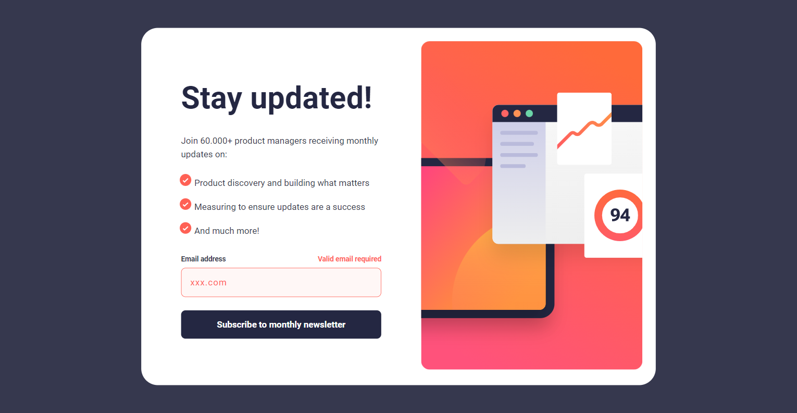

# Frontend Mentor - Newsletter sign-up form with success message solution

This is a solution to the [Newsletter sign-up form with success message challenge on Frontend Mentor](https://www.frontendmentor.io/challenges/newsletter-signup-form-with-success-message-3FC1AZbNrv). Frontend Mentor challenges help you improve your coding skills by building realistic projects. 

## Table of contents

- [Overview](#overview)
  - [The challenge](#the-challenge)
  - [Screenshot](#screenshot)
  - [Links](#links)
- [My process](#my-process)
  - [Built with](#built-with)
  - [What I learned](#what-i-learned)
  - [Continued development](#continued-development)
  - [Useful resources](#useful-resources)
- [Author](#author)

## Overview

### The challenge

Users should be able to:

- Add their email and submit the form
- See a success message with their email after successfully submitting the form
- See form validation messages if:
  - The field is left empty
  - The email address is not formatted correctly
- View the optimal layout for the interface depending on their device's screen size
- See hover and focus states for all interactive elements on the page

### Screenshot

### Links

- Solution URL: [Solution](https://github.com/MatheusHG94/newsletter-sign-up)
- Live Site URL: [Live site](https://newsletter-sign-up-seven.vercel.app/)

## My process

### Built with

- Semantic HTML5 markup
- CSS custom properties
- Flexbox
- Mobile-first workflow
- [React](https://reactjs.org/) - JS library
- React-router-dom

### What I learned

I'm practicing how to develop using React. This is my first solution using this tool. Hope I'm coding it fine.

### Continued development

I enjoyed the opportunity to test some knowledge on the validation of forms and exhibition of custom error messages. I intend to study it further next.

### Useful resources

- [Mozilla references](https://developer.mozilla.org/pt-BR/docs/Web)
- [React documentation](https://react.dev/reference/react)
- [React router dom documentation](https://reactrouter.com/en/main)

## Author

Matheus Henrique Grande

- GitHub - [@MatheusHG94](https://github.com/MatheusHG94)
- Frontend Mentor - [@MatheusHG94](https://www.frontendmentor.io/profile/MatheusHG94)
- LinkedIn - [@matheushg-7654](https://www.linkedin.com/in/matheushg-7654/)
